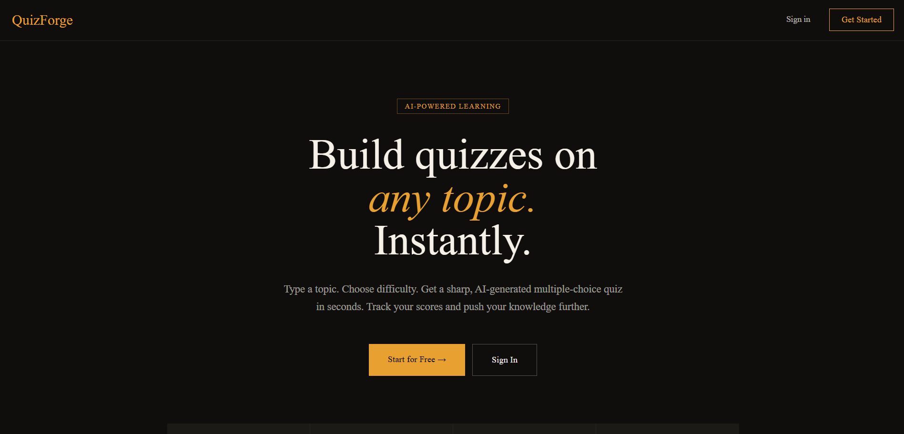
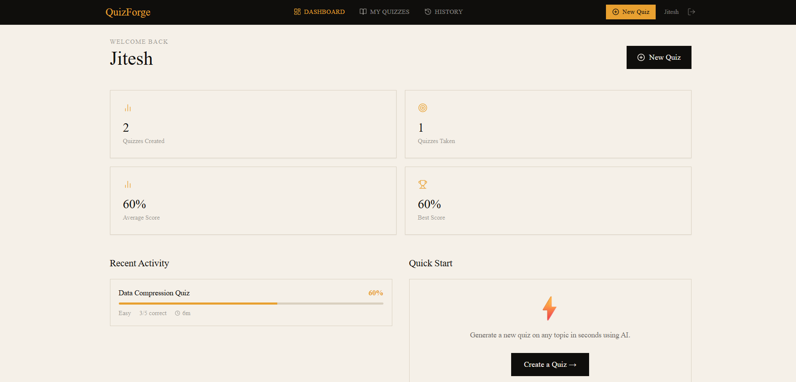
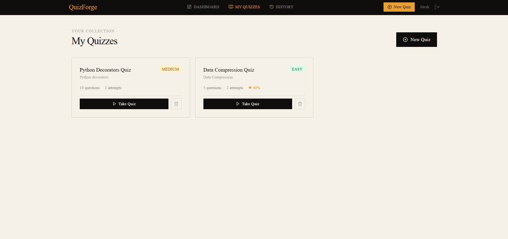
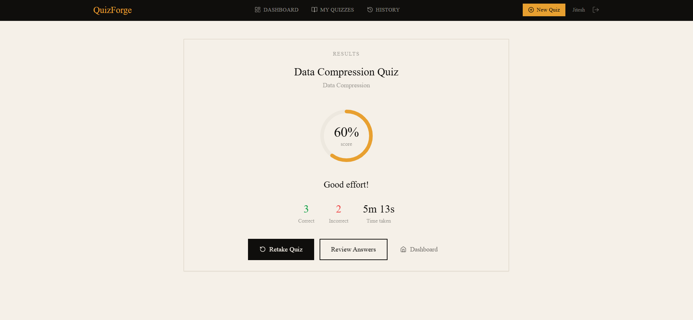

# QuizForge — AI-Powered Quiz Application

A full-stack quiz application where users generate AI-powered quizzes, take them, and track their performance.

**Stack:** Next.js 14 · Django REST Framework · PostgreSQL · JWT Auth · Google Gemini AI

---


## Live Demo

- https://quiz-forge-eta-bice.vercel.app

---


## Screenshots

| | |
|---|---|
|  |  |
|  |  |

---

## Features

- **User auth** — register, login, JWT session management with silent token refresh
- **AI quiz generation** — Gemini (or OpenAI) generates multiple-choice questions on any topic
- **Quiz taking** — one question at a time, instant feedback, progress tracking
- **Results & review** — score, time taken, per-question explanations
- **History** — full attempt history with scores and retake support
- **Dashboard** — stats (total quizzes, average score, best score, recent activity)

---

## Running Locally

### Prerequisites

- Python 3.11+
- Node.js 18+
- PostgreSQL 14+
- A free [Google Gemini API key](https://makersuite.google.com/app/apikey)

---

### Backend Setup

```bash
cd backend

# Create and activate virtualenv
python -m venv venv
source venv/bin/activate   # Windows: venv\Scripts\activate

# Install dependencies
pip install -r requirements.txt

# Configure environment
cp .env.example .env
# Edit .env with your DB credentials and Gemini API key

# Create the database
createdb quizapp   # or use psql: CREATE DATABASE quizapp;

# Run migrations
python manage.py migrate

# Create a superuser (optional, for /admin)
python manage.py createsuperuser

# Start the dev server
python manage.py runserver
```

Backend runs at `http://localhost:8000`

---

### Frontend Setup

```bash
cd frontend

# Install dependencies
npm install

# Configure environment
cp .env.example .env.local
# Set: NEXT_PUBLIC_API_URL=http://localhost:8000/api

# Start the dev server
npm run dev
```

Frontend runs at `http://localhost:3000`

---

## Database Design

### Models

```
User (Django built-in)
  └── Quiz (user FK)
        └── Question (quiz FK)
              └── Choice (question FK, is_correct bool)

User
  └── QuizAttempt (user + quiz FK)
        └── UserAnswer (attempt + question + choice FK)
```

### Key design decisions

**Why separate `Quiz` and `QuizAttempt`?**
A quiz is a template — its questions are fixed. An attempt is a user's session
against that template. This allows retakes (multiple attempts per quiz) without
duplicating questions.

**Why store `is_correct` on `Choice` rather than `Question`?**
Simpler queries: `answer.selected_choice.is_correct` gives the result without
joining to any "correct answer" table. Four choices per question, exactly one
`is_correct=True`.

**Why `unique_together = ['attempt', 'question']` on `UserAnswer`?**
Enforces one answer per question per attempt at the database level, preventing
double-submission bugs.

**`current_question_index` on `QuizAttempt`**
Allows resuming an interrupted quiz. The frontend uses this to restore position
when the page is refreshed mid-quiz.

---

## API Structure

### Auth
| Method | Endpoint | Description |
|--------|----------|-------------|
| POST | `/api/auth/register/` | Create account, returns JWT |
| POST | `/api/auth/login/` | Login, returns JWT |
| POST | `/api/auth/refresh/` | Refresh access token |
| GET  | `/api/auth/me/` | Current user info |

### Quizzes
| Method | Endpoint | Description |
|--------|----------|-------------|
| GET  | `/api/quizzes/` | List user's quizzes |
| POST | `/api/quizzes/` | Create quiz (triggers AI generation) |
| GET  | `/api/quizzes/:id/` | Quiz detail with questions |
| DELETE | `/api/quizzes/:id/` | Delete quiz |
| POST | `/api/quizzes/:id/start/` | Start/resume an attempt |

### Attempts
| Method | Endpoint | Description |
|--------|----------|-------------|
| GET  | `/api/attempts/` | All completed attempts (history) |
| GET  | `/api/attempts/:id/` | Attempt detail with answers review |
| POST | `/api/attempts/:id/answer/` | Submit one answer |
| POST | `/api/attempts/:id/complete/` | Finish attempt, get results |

### Stats
| Method | Endpoint | Description |
|--------|----------|-------------|
| GET  | `/api/stats/` | Dashboard stats for current user |

### Security note
`Choice.is_correct` is **never exposed** in the quiz-taking serializer
(`ChoiceSerializer`). It only appears in `ChoiceWithAnswerSerializer`, used
exclusively after an attempt is completed. Correct answers come back only via
`submitAnswer` (one at a time, after selection) and the review endpoint.

---

## AI Integration

The AI service (`backend/api/ai_service.py`) supports:

1. **Google Gemini** (free tier) — set `GEMINI_API_KEY`
2. **OpenAI GPT-3.5** — set `OPENAI_API_KEY`
3. **Mock fallback** — if no key is set, returns placeholder questions for local dev

The prompt instructs the model to return **pure JSON only** (no markdown fences),
and the parser strips fences defensively anyway. Validation ensures exactly 4
choices and exactly 1 correct answer per question.

---

## Deployment

### Backend → Railway (free tier)

1. Push `backend/` to GitHub
2. Create new Railway project → Deploy from GitHub
3. Add PostgreSQL plugin
4. Set env vars: `SECRET_KEY`, `DEBUG=False`, `GEMINI_API_KEY`, `DATABASE_URL` (auto-set by Railway), `CORS_ALLOWED_ORIGINS`
5. Start command: `gunicorn quiz_api.wsgi`

### Frontend → Vercel

1. Push `frontend/` to GitHub
2. Import project in Vercel
3. Set env var: `NEXT_PUBLIC_API_URL=https://your-railway-url.up.railway.app/api`
4. Deploy

---

## Challenges & Solutions

**1. AI response reliability**
Gemini occasionally returns markdown-fenced JSON or slight schema deviations.
Solution: defensive JSON parsing that strips fences + strict validation that
rejects malformed questions rather than crashing.

**2. Preventing answer cheating**
If the frontend received `is_correct` on all choices, a user could read it from
DevTools. Solution: two separate serializers — `ChoiceSerializer` (no `is_correct`)
for quiz-taking, `ChoiceWithAnswerSerializer` (includes it) only in the review endpoint
which requires a completed attempt.

**3. Resume mid-quiz**
If a user refreshes mid-quiz, their progress is lost. Solution: `current_question_index`
on `QuizAttempt` is updated server-side on every answer submission, and the frontend
reads it on page load to restore position.

**4. JWT token expiry UX**
Without intervention, a user gets silently logged out. Solution: Axios response
interceptor automatically tries the refresh token on a 401, updates the cookie,
and retries the original request — fully transparent to the user.

---

## What I'd Add With More Time

- **Search/filter** quizzes by topic or difficulty
- **Leaderboard** for shared public quizzes
- **Timed quiz mode** with countdown
- **Export results** to PDF
- **Email verification** on register
- **Rate limiting** on quiz generation endpoint (it's expensive)
- **Caching** AI-generated questions by topic hash to reduce API calls
